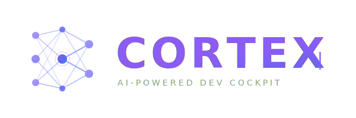

<p align="center">
  <picture>
    <source media="(prefers-color-scheme: dark)" srcset="assets/logo-dark.svg">
    <source media="(prefers-color-scheme: light)" srcset="assets/logo.svg">
    
  </picture>
  <br />
  <p align="center">
    <strong>Your development brain — powered by Claude Code.</strong>
    <br />
    Task management, semantic memory, agent workflows, and git automation — all from your terminal.
  </p>
  <p align="center">
    <a href="https://github.com/jsvitolo/cortex-releases/releases/latest"></a>
    <a href="https://github.com/jsvitolo/cortex-releases/releases/latest"></a>
    <a href="#install"></a>
  </p>
  <p align="center">
    English · <a href="README.pt-BR.md">Português (Brasil)</a>
  </p>
</p>

---

## How It Works

Cortex is designed to work **alongside Claude Code**, not as a standalone CLI you type into.

Once initialized, **Claude Code becomes your interface** — it uses Cortex's 65+ MCP tools to manage tasks, search memory, run agent workflows, and navigate code. You rarely need to type `cx` commands yourself.

```
You → Claude Code → Cortex MCP → Tasks, Memory, Agents, LSP
                              ↓
                           cx ui  (to visualize everything)
```

**The only `cx` commands you'll use directly:**
- `cx init` — set up Cortex in your project (once)
- `cx ui` — open the visual dashboard (whenever you want to see what's going on)

Everything else happens automatically through Claude Code.

---

## Install

**macOS / Linux (Homebrew):**

```bash
brew tap jsvitolo/tap
brew install cx
```

**macOS / Linux (script):**

```bash
curl -sSL https://raw.githubusercontent.com/jsvitolo/cortex-releases/main/install.sh | bash
```

**Manual download:**

Download the latest binary from the [Releases](https://github.com/jsvitolo/cortex-releases/releases/latest) page.

---

## Setup

### 1. Set your OpenAI API key (optional)

```bash
export OPENAI_API_KEY=sk-...
# Add to your ~/.zshrc or ~/.bashrc to persist
```

The key unlocks **semantic memory** — embeddings that let you search memories by meaning, not just keywords. Without it, Cortex is still fully functional:

| Feature | Without key | With key |
|---------|-------------|----------|
| Tasks, git, TUI, agents | ✅ | ✅ |
| Memory search | ✅ keyword (FTS5) | ✅ semantic (HNSW vectors) |
| Memory save | ✅ | ✅ + auto-indexed |
| `cx kb index --summarize` | ❌ | ✅ |
| Learnings extraction | ❌ | ✅ |

### 2. Initialize in your project

```bash
cd your-project
cx init
```

This sets up `.cortex/` (local data), registers the MCP server with Claude Code, and installs the Claude Code plugin (skills + hooks).

### 3. Install the Claude Code plugin

The plugin adds workflow automation hooks and skill shortcuts (`/implement`, `/brainstorm`, `/merge`, `/pr`) to every Claude Code session in this project.

**Inside a Claude Code session**, run:

```
/plugin marketplace add jsvitolo/cortex-plugins
/plugin install cortex@cortex-plugins
```

**Alternative** — edit `~/.claude/settings.json` directly (no Claude Code session required):

```json
{
  "extraKnownMarketplaces": {
    "cortex-plugins": {
      "source": { "source": "github", "repo": "jsvitolo/cortex-plugins" }
    }
  },
  "enabledPlugins": {
    "cortex@cortex-plugins": true
  }
}
```

> `cx init` already handles MCP registration. The plugin install adds the full skills and hooks experience on top.

### 4. Open the dashboard

```bash
cx ui
```

Now open Claude Code in your project and start working — Cortex tracks tasks and memories automatically.

---

## CLAUDE.md Integration

When you run `cx init`, Cortex automatically adds the following rules section to your project's `CLAUDE.md`. This is what makes Claude Code use Cortex tools correctly and consistently.

You can also add it manually by copying the block below:

<details>
<summary><strong>View CLAUDE.md rules section</strong></summary>

```markdown
---

## ⚠️ MANDATORY RULES - Cortex (MUST FOLLOW)

These rules are **absolute** and must be followed in ALL interactions.

---

### 0. 🔴 TOP PRIORITY: ALWAYS use Cortex MCP Tools

**This is the most important rule.** ALWAYS prefer `mcp__cortex__*` over CLI or Bash:

| Operation | MCP Tool ✅ | Do not use ❌ |
|-----------|------------|--------------|
| Create task | `mcp__cortex__task(action="create")` | ~~cx add~~ |
| View task | `mcp__cortex__task(action="get")` | ~~cx show~~ |
| List tasks | `mcp__cortex__task(action="list")` | ~~cx ls~~ |
| Update task | `mcp__cortex__task(action="update")` | ~~cx mv~~ |
| Project status | `mcp__cortex__status()` | ~~cx status~~ |
| Save memory | `mcp__cortex__memory(action="save")` | ~~cx memory diary~~ |
| Search memory | `mcp__cortex__memory(action="list")` | ~~cx memory search~~ |
| Create branch | `mcp__cortex__git(action="branch")` | ~~git checkout -b~~ |
| Create PR | `mcp__cortex__git(action="pr")` | ~~gh pr create~~ |
| Merge PR | `mcp__cortex__git(action="merge")` | ~~gh pr merge~~ |
| Symbols in code | `mcp__cortex__lsp(action="symbols")` | ~~Glob/Grep~~ |
| Go to definition | `mcp__cortex__lsp(action="definition")` | ~~Grep~~ |
| Find references | `mcp__cortex__lsp(action="references")` | ~~Grep~~ |
| Plans | `mcp__cortex__highlevel_plan()` | ~~nothing~~ |
| Brainstorm | `mcp__cortex__brainstorm()` | ~~nothing~~ |

**Legitimate exceptions (use native Claude Code tools):**
- `Read` → read file contents
- `Edit`/`Write` → edit/create files
- `Glob` → file search by pattern
- `Bash` → system commands (make, go install, etc.)

---

### 1. 🚀 At the Start of ANY Work Session

**REQUIRED** — check current state before anything else:

```
# 1. Project overview
mcp__cortex__status()

# 2. Draft plans pending approval?
mcp__cortex__highlevel_plan(action="list")

# 3. Tasks stuck in progress (no activity)?
mcp__cortex__task(action="list", status="progress")

# 4. Tasks in review waiting for merge?
mcp__cortex__task(action="list", status="review")
```

If there are **draft** plans → ask user if they want to review them before creating new tasks.
If there are **in-progress** tasks → ask if they want to continue or if they are abandoned.
If there are **review** tasks → ask if they want to merge before starting new work.

---

### 2. 📋 Task Management — ALWAYS via MCP

```
# CREATE task before any work
mcp__cortex__task(action="create", title="Title", type="feature|bug|chore")

# START task before implementing
mcp__cortex__task(action="update", id="CX-N", status="progress")

# FINISH task when complete
mcp__cortex__task(action="update", id="CX-N", status="done")
```

**NEVER** work without an associated Cortex task.

---

### 3. 🧠 Development Workflow — Choose the right mode

Before implementing, evaluate and choose:

```
Is the solution clear?
├── No  → /brainstorm "title"   (explore ideas, vote, decide)
│              ↓
│         /plan "title"          (document the design)
│              ↓
│         create task + /implement
│
└── Yes → Is it complex?
          ├── Yes → /plan "title"  (document approach)
          │              ↓
          │         create task + /implement
          │
          └── No → create task + /implement  (direct)
```

#### When to use `/brainstorm`:
- New feature **without clear design**
- **Multiple approaches** possible
- Need to **explore trade-offs** before deciding

#### When to use `/plan`:
- Design **already defined**, needs documentation
- **Complex feature** that needs a spec before code

#### When to go directly to task + `/implement`:
- Bug fix with **known cause**
- **Small feature** with clear scope
- Following an **already approved plan**

---

### 4. 🤖 Agent Workflow — USE `/implement` for code

**RULE:** For ANY code implementation, use the `/implement` skill:

```bash
/implement CX-N              # Runs workflow for existing task
/implement "Add new feature" # Creates task and runs workflow
```

The 3-agent workflow (research → implement → verify) is **REQUIRED** for:
- New features / bug fixes / refactorings / adding tests

**DO NOT use** for: small fixes, doc updates, questions about code.

---

### 5. 🔀 Git Workflow — ALWAYS via MCP

```
# Create branch for the task
mcp__cortex__git(action="branch", task_id="CX-N")

# Push + create PR + move task to review
mcp__cortex__git(action="pr")
# or: /pr

# Squash merge + delete branch + move task to done
mcp__cortex__git(action="merge")
# or: /merge
```

Conventional Commits — required format:
`feat(scope): description (CX-N)` | `fix` | `chore` | `refactor` | `docs`

---

### 6. 💾 Memory — Search BEFORE asking

```
# ALWAYS search context before asking user questions
mcp__cortex__memory(action="list", search="relevant term")

# At the end of a significant session
mcp__cortex__memory(action="save", type="diary", title="Session ...", content="...")
```

---

### 7. 🔍 LSP — Code analysis via Cortex MCP

```
mcp__cortex__lsp(action="symbols", file="path/to/file.go")
mcp__cortex__lsp(action="definition", file="...", line=10, column=5)
mcp__cortex__lsp(action="references", file="...", line=10, column=5)
mcp__cortex__lsp(action="hover", file="...", line=10, column=5)
```

Supported languages: Go, Rust, TypeScript, Python, Elixir

---

## Cortex Quick Reference

### MCP Tools

| Tool | Action |
|------|--------|
| `mcp__cortex__status()` | Project overview |
| `mcp__cortex__task(action="create", title="...")` | Create task |
| `mcp__cortex__task(action="list")` | List tasks |
| `mcp__cortex__task(action="update", id="CX-N", status="progress")` | Update status |
| `mcp__cortex__memory(action="list", search="q")` | Search memories |
| `mcp__cortex__memory(action="save", type="diary", ...)` | Save memory |
| `mcp__cortex__git(action="pr")` | Create PR |
| `mcp__cortex__git(action="merge")` | Merge PR |
| `mcp__cortex__highlevel_plan(action="list")` | List plans |

### Skills (Claude Code)

| Skill | Purpose |
|-------|---------|
| `/implement CX-N` | Execute 3-agent workflow |
| `/pr` | Create PR + move task to review |
| `/merge` | Merge PR + move task to done |
| `/brainstorm "title"` | Explore ideas before committing |
| `/plan "title"` | Document approach/design |
| `/session-end` | Save context before ending |
```

</details>

> `cx init` adds this automatically. You only need to copy it manually if you're adding Cortex to a project that was already initialized.

---

## What Claude Code Can Do With Cortex

Once set up, just talk to Claude Code naturally:

| You say... | Claude Code does... |
|------------|---------------------|
| "Let's implement the auth feature" | Creates a task, runs 3-agent workflow |
| "I'm not sure how to approach this" | Starts a brainstorm session |
| "What did we decide about the DB schema?" | Searches semantic memory |
| "Open a PR for this" | Pushes, creates PR, moves task to review |
| "Merge and release" | Squash merges, tags, triggers CI release |

### Skills (slash commands in Claude Code)

| Skill | What it does |
|-------|--------------|
| `/implement CX-N` | Runs the 3-agent workflow (research → implement → verify) |
| `/brainstorm "idea"` | Starts an interactive brainstorm session |
| `/plan "title"` | Creates or edits a high-level plan |
| `/start CX-N` | Creates branch, enters worktree, moves task to progress |
| `/pr` | Pushes branch, creates PR, moves task to review |
| `/merge` | Squash merges PR, deletes branch, moves task to done |

### Example: From idea to shipped

Not sure how to approach something? Start with `/brainstorm`:

```
You:           /brainstorm "Add real-time notifications"

Claude Code:   → Creates brainstorm session BS-1
               → You add ideas: WebSockets, SSE, polling
               → Vote on the best approach
               → Decide: SSE (simpler, no extra deps)
               → /plan → documents the design
               → Creates task CX-42

You:           /implement CX-42

Claude Code:   → research agent: reads codebase, checks memory
               → implement agent: writes code following the plan
               → verify agent: runs tests, reviews changes
               → Task moves to review automatically

You:           /pr    →  /merge    →  done ✓
```

---

## Visual Dashboard (`cx ui`)

```
┌─ Cortex ──────────────────────────────────────────────────────────────┐
│                                                                       │
│  Backlog        In Progress     Review          Done                  │
│  ┌───────────┐  ┌───────────┐  ┌───────────┐  ┌───────────┐           │
│  │ CX-3      │  │ CX-1      │  │ CX-4      │  │ CX-2      │           │
│  │ Add API   │  │ Auth      │  │ Tests     │  │ Setup DB  │           │
│  │ feature   │  │ feature   │  │ chore     │  │ chore     │           │
│  └───────────┘  └───────────┘  └───────────┘  └───────────┘           │
│  ┌───────────┐                                ┌───────────┐           │
│  │ CX-5      │                                │ CX-6      │           │
│  │ Dark mode │                                │ CI/CD     │           │
│  │ feature   │                                │ chore     │           │
│  └───────────┘                                └───────────┘           │
│                                                                       │
├───────────────────────────────────────────────────────────────────────┤
│  a: add  e: edit  ↑↓: navigate  ←→: move  /: search  q: quit          │
└───────────────────────────────────────────────────────────────────────┘
```

| View | Key | Description |
|------|-----|-------------|
| Dashboard | (home) | Overview: stats, recent tasks, shortcuts |
| Kanban | `k` | Task board with columns |
| Table | `t` | Sortable task list |
| Plans | `p` | High-level plans with inline comments |
| Brainstorm | `b` | Idea sessions with voting |
| Memory | `m` | Browse semantic memories |
| Worktrees | `w` | Active git worktrees |
| Agents | `g` | Agent session monitoring |
| Settings | `s` | Sound notifications + agent model selection |

---

## Features

- **Task Management** — Epics and tasks with full lifecycle tracking
- **Brainstorm Mode** — Explore ideas with voting, pros/cons, and decisions before committing
- **Plans** — High-level planning with markdown editing and inline comments
- **Semantic Memory** — Capture learnings with hybrid search (FTS5 + HNSW vectors)
- **Agent Workflow** — 3-agent autonomous workflow (research → implement → verify)
- **Agent Model Selection** — Choose which Claude model to use per agent (default, research, implement, verify) from the Settings TUI
- **Sound Notifications** — Warcraft peon voice pack plays on task/agent events, configurable per event type and volume
- **65+ MCP Tools** — Deep Claude Code integration
- **LSP Integration** — Code analysis with Go, Rust, TypeScript support
- **Git-Backed Sync** — All data syncs via git for collaboration and backup

---

## Requirements

- **Claude Code** — the primary interface
- **OpenAI API key** — for semantic memory (`OPENAI_API_KEY`)
- **GitHub CLI** (optional) — for PR/merge automation (`gh auth login`)

---

## Tech Stack

- **TUI**: [Charm](https://charm.sh/) (Bubble Tea, Lip Gloss, Glamour)
- **Storage**: SQLite + FTS5 + HNSW (vector search)
- **Embeddings**: OpenAI `text-embedding-3-small`
- **Integration**: MCP Server for Claude Code

---

## License

MIT

---

<p align="center">
  Built with <a href="https://go.dev">Go</a>, <a href="https://github.com/charmbracelet/bubbletea">Bubble Tea</a>, and <a href="https://www.anthropic.com/claude">Claude</a>.
</p>
