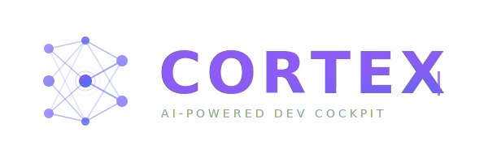

<p align="center">
  <picture>
    <source media="(prefers-color-scheme: dark)" srcset="assets/logo-dark.svg">
    <source media="(prefers-color-scheme: light)" srcset="assets/logo.svg">
    
  </picture>
  <br />
  <p align="center">
    <strong>Seu cockpit de desenvolvimento com IA.</strong>
    <br />
    Gerenciamento de tarefas, memória semântica, orquestração de agentes e automação git — tudo pelo terminal.
  </p>
  <p align="center">
    <a href="https://github.com/jsvitolo/cortex-releases/releases/latest"></a>
    <a href="https://github.com/jsvitolo/cortex-releases/releases/latest"></a>
    <a href="#instalar"></a>
  </p>
  <p align="center">
    <a href="README.md">English</a> · Português (Brasil)
  </p>
</p>

---

## O que é o Cortex?

Cortex (`cx`) é uma plataforma de desenvolvimento terminal-first que reúne tudo que você precisa para manter o foco:

- **Gerenciamento de Tarefas** — Kanban board, prioridades, dependências e rastreamento completo do ciclo de vida
- **Memória Semântica** — Lembre de decisões, padrões e contexto entre sessões usando busca híbrida (FTS5 + vetores HNSW)
- **Orquestração de Agentes** — Workflows multi-agente (pesquisa → implementação → verificação) com Claude Code
- **Automação Git** — Branches, PRs e merges vinculados a tarefas — zero troca de contexto
- **Dashboard TUI** — Interface de terminal bonita com Kanban, browser de memória, monitor de agentes e mais
- **Integração MCP** — [102 ferramentas](docs/mcp.md) para Claude Code, tornando o desenvolvimento assistido por IA fluido

## Início Rápido

### Instalar

**macOS / Linux (Homebrew):**

```bash
brew tap jsvitolo/tap
brew install cx
```

**macOS / Linux (script):**

```bash
curl -sSL https://raw.githubusercontent.com/jsvitolo/cortex-releases/main/install.sh | bash
```

**Download manual:**

Baixe o binário mais recente na página de [Releases](https://github.com/jsvitolo/cortex-releases/releases/latest).

### Configuração

```bash
# Inicializar Cortex no seu projeto
cx init

# Criar sua primeira tarefa
cx add "Configurar autenticação" --type feature

# Abrir a TUI
cx ui
```

### Dependências

O Cortex precisa de algumas ferramentas para funcionar por completo:

**macOS:**

```bash
# Obrigatório: Git (geralmente já instalado)
xcode-select --install

# Obrigatório: Chave da OpenAI (para memória semântica)
export OPENAI_API_KEY=sk-...       # Adicione ao ~/.zshrc ou ~/.bashrc

# Opcional: Claude Code (para orquestração de agentes)
npm install -g @anthropic-ai/claude-code

# Opcional: GitHub CLI (para automação de PR/merge)
brew install gh
gh auth login
```

**Linux (Debian/Ubuntu):**

```bash
# Obrigatório: Git
sudo apt-get install -y git

# Obrigatório: Chave da OpenAI (para memória semântica)
export OPENAI_API_KEY=sk-...       # Adicione ao ~/.bashrc

# Opcional: Claude Code (para orquestração de agentes)
npm install -g @anthropic-ai/claude-code

# Opcional: GitHub CLI (para automação de PR/merge)
sudo apt-get install -y gh
gh auth login
```

**Linux (Fedora/RHEL):**

```bash
# Obrigatório: Git
sudo dnf install -y git

# Obrigatório: Chave da OpenAI (para memória semântica)
export OPENAI_API_KEY=sk-...       # Adicione ao ~/.bashrc

# Opcional: Claude Code (para orquestração de agentes)
npm install -g @anthropic-ai/claude-code

# Opcional: GitHub CLI (para automação de PR/merge)
sudo dnf install -y gh
gh auth login
```

> **Nota:** Sem a chave da OpenAI, o Cortex funciona normalmente para gerenciamento de tarefas, automação git e TUI — apenas a busca semântica na memória requer embeddings.

## Funcionalidades

### Gerenciamento de Tarefas

Acompanhe seu trabalho com um sistema completo de tarefas inspirado no [beads](https://github.com/steveyegge/beads).

```bash
cx add "Implementar auth" --type feature    # Criar tarefa → CX-1
cx start CX-1                               # Mover para em progresso + criar branch
cx done CX-1                                # Completar + limpar
```

Tarefas possuem status (`backlog` → `progress` → `review` → `done`), tipos, prioridades, documentos de design, critérios de aceitação e dependências.

### Interface de Terminal (TUI)

Uma interface bonita e controlada por teclado construída com [Bubble Tea](https://github.com/charmbracelet/bubbletea).

```
┌─ Cortex ──────────────────────────────────────────────────────────────┐
│                                                                       │
│  Backlog        In Progress     Review          Done                  │
│  ┌───────────┐  ┌───────────┐  ┌───────────┐  ┌───────────┐          │
│  │ CX-3      │  │ CX-1      │  │ CX-4      │  │ CX-2      │          │
│  │ Add API   │  │ Auth      │  │ Tests     │  │ Setup DB  │          │
│  │ feature   │  │ feature   │  │ chore     │  │ chore     │          │
│  └───────────┘  └───────────┘  └───────────┘  └───────────┘          │
│  ┌───────────┐                                ┌───────────┐          │
│  │ CX-5      │                                │ CX-6      │          │
│  │ Dark mode │                                │ CI/CD     │          │
│  │ feature   │                                │ chore     │          │
│  └───────────┘                                └───────────┘          │
│                                                                       │
├───────────────────────────────────────────────────────────────────────┤
│  a: add  e: edit  ↑↓: navegar  ←→: mover  /: buscar  q: sair        │
└───────────────────────────────────────────────────────────────────────┘
```

Visões: **Kanban Board** · **Detalhe da Tarefa** · **Browser de Memória** · **Dashboard de Agentes** · **Monitor de Agentes**

### Memória Semântica

Nunca perca contexto novamente. O Cortex armazena decisões, diários de sessão, boas práticas e aprendizados com busca semântica.

```bash
cx memory diary "Implementei OAuth2 com fluxo PKCE"     # Salvar contexto
cx memory search "abordagem de autenticação"              # Busca semântica
cx memory reflect                                         # Analisar padrões
cx memory rules                                           # Gerar regras dos padrões
```

**Como funciona:**
- Textos são convertidos em embeddings usando OpenAI `text-embedding-3-small`
- Armazenados localmente em SQLite com índice vetorial HNSW (busca O(log n))
- Busca híbrida combina FTS5 por palavras-chave (40%) + similaridade vetorial HNSW (60%)
- Tudo fica local — seus dados nunca saem da sua máquina

### Orquestração de Agentes

O Cortex orquestra workflows multi-agente para tarefas de código. Cada tarefa passa por três fases:

```
┌──────────┐     ┌───────────┐     ┌──────────┐
│ Pesquisa │ ──▶ │ Implement │ ──▶ │ Verificar│ ──▶ done
└──────────┘     └───────────┘     └──────────┘
     │                │                 │
     ▼                ▼                 ▼
  Entender         Escrever          Rodar testes
  codebase         código            lint, review
  + planejar       seguindo          + relatório
                   o plano
```

**Execução paralela** com workflows DAG:

```
research-explore ──┐                              verify-test   ──┐
research-memory  ──┼──▶ synth ──▶ implement ──▶   verify-lint  ──┼──▶ report
research-impact  ──┘                              verify-review ──┘
```

11 agentes especializados, regras de aprovação configuráveis, monitoramento em tempo real pela TUI.

### Automação Git

O Cortex vincula seu workflow git diretamente às tarefas:

```bash
cx start CX-1      # Cria branch feat/cx-1-descricao
                    # Cria git worktree em .worktrees/cx-1/

# ... trabalha na tarefa ...

cx pr CX-1          # Push + cria PR + move tarefa para "review"
cx merge CX-1       # Squash merge + deleta branch + move tarefa para "done"
```

**Git worktrees** permitem trabalhar em múltiplas tarefas simultaneamente, cada uma no seu próprio diretório com seu próprio branch.

### Integração com Claude Code (MCP)

O Cortex expõe **102 ferramentas** via [MCP (Model Context Protocol)](https://modelcontextprotocol.io/) para integração profunda com o Claude Code:

```bash
# Registrar Cortex como servidor MCP
claude mcp add cortex -- cx mcp serve
```

| Categoria | Exemplos | Qtd |
|-----------|----------|-----|
| Gerenciamento de Tarefas | `task_create`, `task_list`, `task_update` | 4 |
| Memória | `memory_save`, `memory_list`, `memory_link` | 3 |
| Automação Git | `git_branch`, `git_pr`, `git_merge` | 3 |
| Orquestração de Agentes | `agent_spawn`, `task_orchestrate`, `agent_report` | 9 |
| LSP Inteligência de Código | `lsp_symbols`, `lsp_definition`, `lsp_references` | 12 |
| Planejamento & Brainstorm | `plan_create`, `brainstorm_create`, `brainstorm_to_plan` | 14 |
| Regras de Negócio | `business_rule_extract`, `rules_extract` | 8 |
| Banco de Dados (PostgreSQL) | `db_query`, `db_schema`, `db_sample` | 5 |
| Epics & Workflows | `epic_orchestrate`, `workflow_status` | 8 |
| Verificação & Learnings | `verify_task`, `learnings_relevant` | 5 |
| E mais... | Fases, DoD, Controller, Thinking tools | 31 |

> **[Ver documentação completa do MCP (102 ferramentas) →](docs/mcp.md)**
>
> **[Como usar Claude Code + Cortex →](docs/claude-code.md)**

### Sistema de Aprendizado

O Cortex aprende com seu trabalho e melhora ao longo do tempo:

```
Tarefa concluída → Verificação → Extração de padrões → Salvo como aprendizado
                                                              ↓
Próxima tarefa similar ← Agentes aplicam padrões ← Recuperado por relevância
```

Tipos: `success_pattern` · `failure_pattern` · `domain_knowledge` · `user_feedback`

## Arquitetura

```
Go 1.24+
├── SQLite + HNSW + FTS5 (armazenamento local + busca)
├── Bubble Tea + Lip Gloss (UI de terminal)
├── MCP Server (integração com Claude Code)
├── OpenAI Embeddings (text-embedding-3-small)
└── Git Worktrees (isolamento paralelo de tarefas)
```

Tudo roda localmente. Nenhum serviço cloud necessário (exceto OpenAI para embeddings).

## Referência CLI

```
cx init                  Inicializar Cortex no diretório atual
cx status                Visão geral do projeto

cx add "título"          Criar uma tarefa
cx ls                    Listar tarefas
cx show CX-1             Mostrar detalhes da tarefa
cx start CX-1            Começar a trabalhar (branch + worktree)
cx done CX-1             Completar tarefa

cx memory search "q"     Busca semântica na memória
cx memory diary "..."    Salvar contexto da sessão
cx memory reflect        Analisar padrões

cx agent ps              Listar agentes em execução
cx agent logs <id> -f    Acompanhar logs do agente

cx ui                    Abrir interface de terminal
cx mcp serve             Iniciar servidor MCP
```

## Licença

MIT

---

<p align="center">
  Feito com <a href="https://go.dev">Go</a>, <a href="https://github.com/charmbracelet/bubbletea">Bubble Tea</a> e <a href="https://www.anthropic.com/claude">Claude</a>.
</p>
